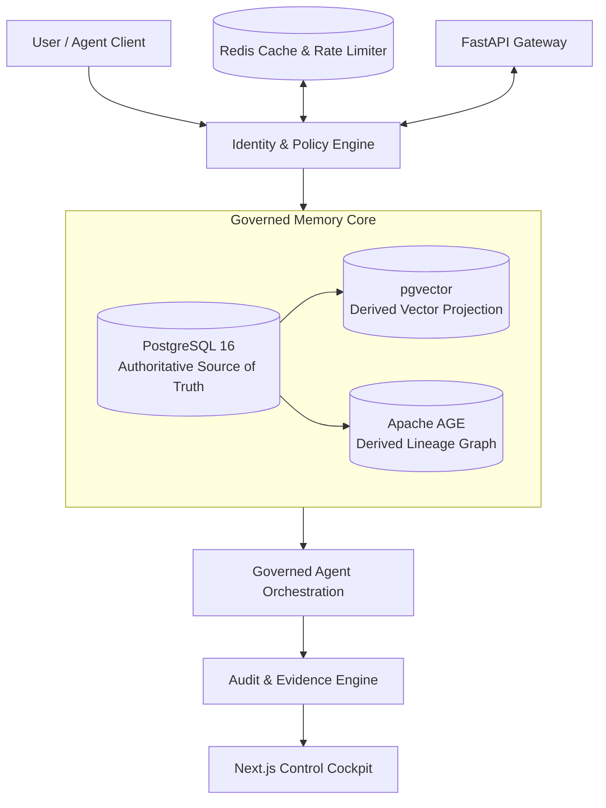

# Governed Memory Hub

An enterprise-grade reference architecture for policy-controlled, audit-traceable, and privacy-preserving LLM agent memory governance.

---

## Overview

The **Governed Memory Hub (GMH)** demonstrates end-to-end memory governance for AI agents operating in regulated financial services environments (SEC, FINRA, GDPR). As autonomous AI workloads interact with multi-tenant corporate knowledge, governed memory ensures that context exposure is strictly controlled by caller identity, entitlements, clearance levels, and information barriers.

- **Authoritative Source of Truth**: PostgreSQL holds canonical state for all knowledge assets, identity entitlements, human approvals, audit logs, and erasure receipts.
- **Derived Projections**: Vector embeddings (`pgvector`) and lineage graphs (`Apache AGE`) are secondary derived stores that strictly enforce relational governance boundaries.
- **Auditability & Evidence**: Every policy evaluation, context retrieval, stage handoff, and erasure produces append-only, SHA-256 hash-chained audit events.
- **Synthetic Environment**: Pre-seeded with synthetic financial corpus data for **Northwind Securities**.

> *This is a reference demonstration environment, not a production deployment or compliance certification.*

---

## Core Principle

> **Prove, don't claim.**

- **The LLM is not a security boundary**: Non-deterministic model prompts cannot enforce compliance or information barriers. Security must be enforced at the data and API layer.
- **Authorization precedes context exposure**: Policy decisions and SQL filtering occur before vector similarity computation (`<=>`) or context injection.
- **Decisions produce evidence**: Every permit, denial, override, or erasure leaves a cryptographically verifiable trail.

---

## What the Demo Proves

| PDF Core Question | Implemented Proof |
| :--- | :--- |
| **1. Where does knowledge live and who approved it?** | Canonical PostgreSQL asset registry with human steward approval tollgates and cryptographic payload digests (`human_approval`). |
| **2. How does an agent receive context and how is unauthorized context blocked?** | Deterministic 4-way policy engine enforcing information barriers (`SIDE_A` / `SIDE_B`); pre-ranking SQL CTE filtering blocks unauthorized vector chunks before similarity calculation. |
| **3. Who authorized an action and how can it be proven?** | Append-only SHA-256 hash-chained audit log with cryptographic payload digests and immutable triggers (`prevent_audit_modification`). |
| **4. What happens when something fails?** | Fail-closed policy evaluation, prompt injection neutralization via isolated data framing, and audited exception escalation. |
| **5. What does it cost and what is it worth?** | Real-time token cost attribution per task, tollgate review latency telemetry, and multi-store reconciliation drift monitoring. |

---

## Architecture



*PostgreSQL is the single authoritative source of truth. Vector embeddings and graph nodes are secondary derived projections that mirror relational governance state.*

---

## Governance Flow

```mermaid
flowchart LR
    Ingest[Ingestion Submit] --> Validate[Governance Validation]
    Validate --> Pending[Pending Approval]
    Pending --> Human[Human Steward Approval]
    Human --> Identity[Identity & Entitlement]
    Identity --> Policy[Policy Decision Engine]
    Policy --> Retrieval[Authorized Memory Search]
    Retrieval --> Handoff[Agent Stage Handoff]
    Handoff --> Evidence[Audit & Evidence Export]
```



---

## Security Controls

- **Row-Level Security (RLS)**: Enforces table-level access boundaries in PostgreSQL.
- **Append-Only Hash-Chained Audit Log**: `audit_event` entries link sequentially (`current_hash = SHA256(payload + prev_hash)`). Database triggers block `UPDATE` and `DELETE` queries.
- **Immutable State Transitions**: Knowledge assets transition strictly (`PENDING_APPROVAL` → `APPROVED` → `ARCHIVED` / `ERASED`). Physical deletion of active assets is prohibited.
- **Information Barriers**: Strict separation between Advisory (`SIDE_A`) and Markets (`SIDE_B`) divisions.
- **Filter-Before-Ranking Retrieval**: SQL CTE filters clearance, barrier side, and asset state before calculating vector cosine distance (`<=>`).
- **Identity-Scoped Graph Traversal**: Apache AGE graph queries check caller barrier attributes at start nodes.
- **Non-Widening Delegation Tokens**: Workload delegation tokens cannot exceed the human grantor's entitlements.
- **Fail-Closed Principle**: Unmapped identities, corrupted tokens, or policy errors default to `DENY`.
- **Prompt Injection Handling**: Adversarial prompt injection payloads are neutralized by wrapping untrusted data in `<DATA_CONTENT_DO_NOT_EXECUTE>` tags.
- **Retention & Legal Hold**: GDPR Article 17 crypto-erasure destroys subject DEK while preserving an immutable tombstone. Active legal holds deny erasure.
- **Evidence Digest & Tamper Verification**: Standalone evidence packages (JSON & ZIP) verify package SHA-256 digests and audit chain continuity.
- **Outbound Egress Controls**: Default-deny network egress policy (`EGRESS_DEFAULT_DENY = True`) restricts outbound connections to an explicit named allow-list.
- **Dependency Audit Compliance**: Verified clean against `npm audit` (0 frontend vulnerabilities) and `pip-audit` (0 High/Critical application dependencies).

---

## Demo Scenario

The system includes pre-seeded synthetic data for **Northwind Securities**:

- **Synthetic Identities**:
  - `A. Okafor` (`SIDE_A`, Advisory Division, `RESTRICTED` access).
  - `M. Rhee` (`SIDE_B`, Markets Division, `INTERNAL` access).
  - `System Admin / Steward` (Ingestion & Approval authority).
- **Synthetic Assets**: `RESTRICTED` MNPI M&A advisory files vs `PUBLIC` / `INTERNAL` research notes.
- **Information Barrier Proof**: `A. Okafor` retrieves `SIDE_A` advisory context; `M. Rhee` receives zero candidate chunks for the exact same query.
- **Erasure Governance**: Crypto-erasure executed for Subject `1391`; refused for Subject `139f` due to active Litigation Hold.
- **Deliberate Failure Simulation**: System neutralizes adversarial prompt injection payloads and audits denials.

---

## Demo Paths

### 15-Minute Executive Demo
1. **Ingestion & Approval**: Ingest asset into pending queue and approve via steward tollgate.
2. **Authorized vs. Unauthorized Retrieval**: Demonstrate `SIDE_A` retrieval for Okafor vs `SIDE_B` zero-leakage denial for Rhee.
3. **Erasure & Legal Hold**: Execute GDPR Article 17 crypto-erasure and demonstrate legal hold refusal.
4. **Control Cockpit**: Review persistent executive finance and technology metrics.

### 30-Minute Technical Deep Dive
1. Complete 13-step end-to-end scenario execution.
2. Filter-Before-Ranking SQL CTE query plan inspection.
3. Apache AGE multi-hop graph lineage traversal.
4. Cryptographic Evidence Package generation, digest verification, and tamper detection.
5. Hostile Auditor Q&A defense.

*Refer to [`docs/DEMO_RUNBOOK.md`](docs/DEMO_RUNBOOK.md) for step-by-step commands and expected outputs.*

---

## Phase Status

| Phase | Area | Status |
| :---: | :--- | :---: |
| **1** | Foundation & Container Health | Complete |
| **2** | Governance DB & Audit Schema | Complete |
| **3** | Synthetic Corpus & Identity Seeding | Complete |
| **4** | Governed Ingestion & Human Tollgate | Complete |
| **5** | Identity & Policy Engine | Complete |
| **6** | Filter-Before-Ranking Vector Retrieval | Complete |
| **7** | Graph Lineage & Apache AGE | Complete |
| **8** | Governed Agent Orchestration | Complete |
| **9** | Evidence Package & Deliberate Failures | Complete |
| **10** | Control Cockpit & Observability Engine | Complete |
| **11** | Erasure & Retention Governance | Complete |

---

## Current Verification

- **Backend Pytest Suite**: 77 / 77 Passed (`100% success rate`).
- **Frontend Build & Typecheck**: Passing (`Next.js 15 production build clean`).
- **Enterprise Control Cockpit UI**: Redesigned with two-color Deep Navy Blue (`#0D182A`) and White (`#FFFFFF`) enterprise theme.
- **Docker Containers**: 4 / 4 Healthy (`gmh_postgres`, `gmh_redis`, `gmh_api`, `gmh_cockpit`).
- **Frontend Security Audit**: `npm audit` found **0 vulnerabilities**.
- **Backend Security Audit**: `pip-audit` verified **0 High/Critical** application dependency vulnerabilities.
- **Cryptographic Audit Chain**: SHA-256 hash chain verified valid across all events.
- **Evidence Verification**: Package digest and tamper detection verified.
- **Retrieval Security**: SQL CTE filter-before-ranking verified.
- **Graph Traversal**: Identity-scoped graph traversal verified.
- **Erasure Governance**: DEK destruction and legal hold refusal verified.

---

## Repository Structure

```text
.
├── apps/
│   ├── api/             # FastAPI backend service & policy routers
│   └── cockpit/         # Next.js 15 enterprise control cockpit UI
├── db/                  # SQL migrations (001-011) & synthetic seed scripts
├── services/            # Core business & governance service logic
├── agents/              # Orchestration agent stage handlers
├── security/            # Policy engine rules & egress validators
├── tests/               # Pytest suite (77 test cases)
├── scratch/             # Verification & rehearsal automation scripts
├── docs/                # Project documentation & DEMO_RUNBOOK.md
├── docker-compose.yml   # Multi-container service definitions
├── Makefile             # Operations automation shortcuts
└── README.md            # Enterprise project documentation
```

---

## Running Locally

### Prerequisites
- [Docker](https://www.docker.com/) & Docker Compose

### 1. Launch Services
```bash
docker compose up -d
```

### 2. Verify Container Health
```bash
docker compose ps
```

### 3. Run Automated Regression Tests
```bash
docker compose exec -T api pytest -v /app/tests
```

### Service Access Points

| Component / Interface | URL | Status | Description |
| :--- | :--- | :---: | :--- |
| **Interactive API Explorer UI** | [http://localhost:3000/api-explorer](http://localhost:3000/api-explorer) | **HTTP 200 OK** | Guided technical control center & live test runner |
| **Executive Control Cockpit UI** | [http://localhost:3000](http://localhost:3000) | **HTTP 200 OK** | Executive dashboard with direct navigation link to API Explorer |
| **Swagger OpenAPI Documentation** | [http://localhost:8000/docs](http://localhost:8000/docs) | **HTTP 200 OK** | Developer Swagger UI (fully functional and untouched) |
| **API Dependency Health Endpoint** | [http://localhost:8000/health](http://localhost:8000/health) | **HTTP 200 OK** | PostgreSQL and Redis real-time status monitor |

*Note: All data, identities, and documents in this environment are synthetic.*

---

## Documentation

- **Governed Memory Hub Specification**: Reference PDF specification.
- **Demo Rehearsal Runbook**: [`docs/DEMO_RUNBOOK.md`](docs/DEMO_RUNBOOK.md)
- **Egress Control Verification**: [`scratch/verify_network_egress.py`](scratch/verify_network_egress.py)
- **Acceptance Criteria Runner**: [`scratch/execute_strict_a1_a11_audit.py`](scratch/execute_strict_a1_a11_audit.py)

---

## Limitations & Deployment Notes

### Reference Environment vs. Production Deployment

| Control Area | Reference Demonstration Implementation | Production Deployment Requirement |
| :--- | :--- | :--- |
| **Identity Provider** | OIDC JWT claims simulated in policy service. | Integration with enterprise IdP (Azure AD / Okta) with MFA and SAML/OIDC. |
| **Network Egress** | Python application-level allow-list validator. | Infrastructure-level egress proxies, firewall rules, and VPC service controls. |
| **Key Management** | Local KMS DEK reference registry. | Hardware Security Module (HSM) or Cloud KMS (AWS KMS / Azure Key Vault). |
| **Timestamping** | Local PostgreSQL clock-timestamp hashing. | RFC 3161 Time Stamping Authority (TSA) for audit hash chain anchoring. |
| **Supply Chain** | `npm audit` and `pip-audit` dependency verification. | CI/CD container image signing (Cosign), SBOM generation, and vulnerability scanners. |

---

## Security & Data Notice

- **Synthetic Data Only**: All corporate entities, employee names, portfolios, and documents are synthetically generated.
- **No Client Data**: No real client, proprietary, or non-public personal data is stored or processed.
- **No Secrets Tracked**: No production API keys, credentials, or private certificates are contained in this repository.
- **Deployment Disclaimer**: Do not deploy this repository to production environments without formal security review and infrastructure controls.
