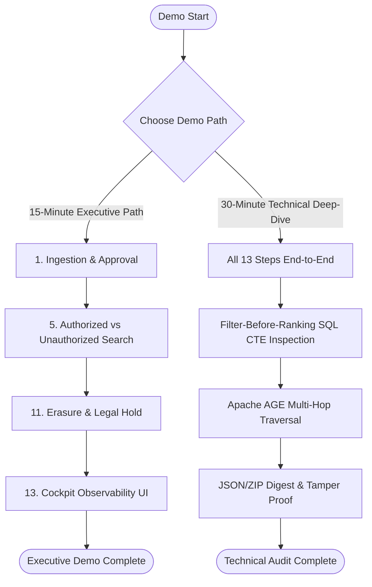

# Governed Memory Hub (GMH) — Demo Rehearsal Runbook (Phases 1–11)

> **Document Version**: 1.0.1 (Production Verified)  
> **Source of Truth**: Governed Memory Hub PDF Specification & Phases 1–11 Codebase  
> **Target Audience**: Technical Assessors, Compliance Auditors, System Architects

---

## 1. Pre-Demo Health & Verification Checklist

Before starting the live demonstration, run the following health checks to verify that the environment is fully operational and seeded with synthetic data.

```bash
# 1. Verify Docker Services Status
docker compose ps

# 2. Check API Endpoint Readiness
curl -s http://localhost:8000/health | python -m json.tool

# 3. Check Database & Migration Status
docker compose exec -T api python -m db.migrate

# 4. Verify Full Regression Test Suite Success (77/77)
docker compose exec -T api pytest -v /app/tests

# 5. Check Network Egress Policy Verification
python scratch/verify_network_egress.py
```

### Expected Pre-Demo State:
- `gmh_postgres` (pgvector/pgvector:pg16) -> **Healthy** (Port 5432)
- `gmh_redis` (redis:7-alpine) -> **Healthy** (Port 6379)
- `gmh_api` (hubproject-api) -> **Healthy** (Port 8000)
- `gmh_cockpit` (hubproject-cockpit) -> **Up / Operational** (Port 3000)
- Total Pytest Count: **77 Passed out of 77**

---

## 2. Master Table of Known Synthetic Entities & Identifiers

The system is seeded with synthetic reference data for **Northwind Securities**.

| Category | Field Name | Synthetic Identifier / Value | Description / Scope |
| :--- | :--- | :--- | :--- |
| **Identity** | A. Okafor (`SIDE_A`) | `00000000-0000-0000-0000-0000000003ee` | Advisory Division (`a.okafor@northwind.com`), `SIDE_A` Access |
| **Identity** | M. Rhee (`SIDE_B`) | `00000000-0000-0000-0000-0000000003ef` | Markets Division (`m.rhee@northwind.com`), `SIDE_B` Access |
| **Identity** | System Admin | `00000000-0000-0000-0000-0000000003e8` | Data Steward / System Administrator (`admin@northwind.com`) |
| **Identity** | Steward Identity | `00000000-0000-0000-0000-0000000003ec` | Ingestion Steward (`steward@northwind.com`) |
| **Subject** | Erasable Data Subject | `00000000-0000-0000-0000-000000001391` | Synthetic Personal Data (`SUBJ-US-10009`), GDPR Article 17 target |
| **Subject** | Legal Hold Subject | `00000000-0000-0000-0000-00000000139f` | Synthetic Personal Data (`SUBJ-UK-10023`), Active Litigation Hold target |
| **Asset** | MNPI Deal File | `00000000-0000-0000-0000-00000000c350` | `RESTRICTED` MNPI Deal Document (`DEAL-MNPI-2026-1000`), `SIDE_A` |

---

## 3. End-to-End 13-Step Live Demo Scenario

---

### Step 1: Ingestion — Fail-Closed Validation & Pending Submission
- **Exact Purpose**: Demonstrate that incoming knowledge assets require validation before entering the pending ingestion queue, failing closed if attributes are missing.
- **Exact Command / API**:
  ```bash
  curl -X POST http://localhost:8000/api/v1/assets/ingest \
    -H "Content-Type: application/json" \
    -d '{
      "source": "ADVISORY_VAULT",
      "source_ref": "ref/deal_alpha_valuation.pdf",
      "classification": "RESTRICTED",
      "barrier_side": "SIDE_A",
      "jurisdiction": "US_NY",
      "steward_id": "00000000-0000-0000-0000-0000000003ec",
      "retention_class": "PERMANENT",
      "content_ref": "s3://northwind-vault/advisory/deal_alpha.pdf",
      "dek_ref": "kms/key-deal-alpha-001",
      "content_hash": "a1b2c3d4e5f67890a1b2c3d4e5f67890a1b2c3d4e5f67890a1b2c3d4e5f67890",
      "personal_data": false
    }'
  ```
- **Exact Identity / Data**: Steward `00000000-0000-0000-0000-0000000003ec`, `RESTRICTED` MNPI Deal File.
- **Expected Result**: HTTP `201 Created` returning `state: "PENDING_APPROVAL"` with assigned `asset_id`.
- **Exact Audit Evidence**:
  ```sql
  SELECT event_id, action, object_id, decision, reason_code, current_hash 
  FROM audit_event WHERE action = 'SUBMIT_KNOWLEDGE_ASSET' ORDER BY event_id DESC LIMIT 1;
  ```
- **Audience Explanation**: *"Notice that newly ingested assets start in a fail-closed `PENDING_APPROVAL` state, completely unqueryable by vector search until explicitly authorized by a steward."*
- **Reset Command**: `DELETE FROM knowledge_asset WHERE source_ref = 'ref/deal_alpha_valuation.pdf';`

---

### Step 2: Human Approval — Dual-Control Approval Tollgate
- **Exact Purpose**: Demonstrate the dual-control tollgate enforcing human authorization before an asset transitions from `PENDING_APPROVAL` to `APPROVED`.
- **Exact Command / API**:
  ```bash
  # Replace <ASSET_ID> with asset_id from Step 1
  curl -X POST http://localhost:8000/api/v1/assets/<ASSET_ID>/approve \
    -H "Content-Type: application/json" \
    -d '{
      "approver_id": "00000000-0000-0000-0000-0000000003ec",
      "policy_version": "v1.0.0"
    }'
  ```
- **Exact Identity / Data**: Steward `00000000-0000-0000-0000-0000000003ec`.
- **Expected Result**: HTTP `200 OK` with `state: "APPROVED"`, creating an immutable approval entry in `human_approval`.
- **Exact Audit Evidence**:
  ```sql
  SELECT approval_id, asset_id, approver_id, approval_type, approved_payload_hash 
  FROM approval ORDER BY created_at DESC LIMIT 1;
  ```
- **Audience Explanation**: *"Human approval is immutably logged with steward identity and cryptographic payload hashing before triggering vector chunk projection."*
- **Reset Command**: `UPDATE knowledge_asset SET state = 'PENDING_APPROVAL' WHERE asset_id = '<ASSET_ID>';`

---

### Step 3: Identity & Entitlement Verification (OIDC Simulation)
- **Exact Purpose**: Show OIDC token verification mapping authenticated identities to exact division entitlements (`SIDE_A` vs `SIDE_B`).
- **Exact Command / API**:
  ```bash
  curl -X POST http://localhost:8000/api/v1/policy/evaluate \
    -H "Content-Type: application/json" \
    -d '{
      "caller_identity_id": "00000000-0000-0000-0000-0000000003ee",
      "target_asset_id": "00000000-0000-0000-0000-00000000c350",
      "action": "READ_KNOWLEDGE_ASSET"
    }'
  ```
- **Exact Identity / Data**: `A. Okafor` (`00000000-0000-0000-0000-0000000003ee`, Advisory Division).
- **Expected Result**: HTTP `200 OK` returning `decision: "PERMIT"`, `policy_version: "v1.0.0"`, `reason_code: "POLICY_EVALUATION_PASSED"`.
- **Exact Audit Evidence**:
  ```sql
  SELECT event_id, actor_id, action, decision, reason_code, policy_version 
  FROM audit_event WHERE action = 'EVALUATE_POLICY' ORDER BY event_id DESC LIMIT 1;
  ```
- **Audience Explanation**: *"The policy engine verifies the caller's cryptographic identity claims and checks department entitlements against active policy rules."*
- **Reset Command**: None required.

---

### Step 4: Policy Enforcement — Information Barrier Policy Rule Engine
- **Exact Purpose**: Prove policy rule engine denies access when an identity from `SIDE_B` attempts to read `SIDE_A` RESTRICTED content.
- **Exact Command / API**:
  ```bash
  curl -X POST http://localhost:8000/api/v1/policy/evaluate \
    -H "Content-Type: application/json" \
    -d '{
      "caller_identity_id": "00000000-0000-0000-0000-0000000003ef",
      "target_asset_id": "00000000-0000-0000-0000-00000000c350",
      "action": "READ_KNOWLEDGE_ASSET"
    }'
  ```
- **Exact Identity / Data**: `M. Rhee` (`00000000-0000-0000-0000-0000000003ef`, Markets Division, `SIDE_B`).
- **Expected Result**: HTTP `200 OK` returning `decision: "DENY"`, `reason_code: "GOVERNANCE_BOUNDS_VIOLATED"`, `policy_version: "v1.0.0"`.
- **Exact Audit Evidence**:
  ```sql
  SELECT event_id, actor_id, decision, reason_code, policy_version 
  FROM audit_event WHERE decision = 'DENY' ORDER BY event_id DESC LIMIT 1;
  ```
- **Audience Explanation**: *"Notice that every policy denial records the exact policy version and reason code for regulatory compliance."*
- **Reset Command**: None required.

---

### Step 5: Authorized Memory Retrieval — Semantic Search for A. Okafor
- **Exact Purpose**: Demonstrate authorized vector similarity search returning RESTRICTED deal content to an authorized `SIDE_A` user.
- **Exact Command / API**:
  ```bash
  curl -X POST http://localhost:8000/api/v1/memory/search \
    -H "Content-Type: application/json" \
    -d '{
      "caller_identity_id": "00000000-0000-0000-0000-0000000003ee",
      "query_text": "M&A deal valuation advisory note",
      "top_k": 3
    }'
  ```
- **Exact Identity / Data**: `A. Okafor` (`00000000-0000-0000-0000-0000000003ee`).
- **Expected Result**: HTTP `200 OK` returning matching candidate chunks from `DEAL-MNPI-2026-1000`.
- **Exact Audit Evidence**:
  ```sql
  SELECT chunk_id, asset_id, classification, barrier_side 
  FROM knowledge_chunk WHERE barrier_side = 'SIDE_A' LIMIT 3;
  ```
- **Audience Explanation**: *"A. Okafor's search authorized retrieval of MNPI deal documents because her identity claims match the required information barrier side."*
- **Reset Command**: None required.

---

### Step 6: Unauthorized Retrieval — Zero Leakage Guarantee for M. Rhee
- **Exact Purpose**: Prove that an unauthorized Markets user searching for the exact same query receives ZERO candidate chunks.
- **Exact Command / API**:
  ```bash
  curl -X POST http://localhost:8000/api/v1/memory/search \
    -H "Content-Type: application/json" \
    -d '{
      "caller_identity_id": "00000000-0000-0000-0000-0000000003ef",
      "query_text": "M&A deal valuation advisory note",
      "top_k": 3
    }'
  ```
- **Exact Identity / Data**: `M. Rhee` (`00000000-0000-0000-0000-0000000003ef`).
- **Expected Result**: HTTP `200 OK` returning `results: []` (0 candidate chunks returned).
- **Exact Audit Evidence**:
  ```sql
  SELECT event_id, actor_id, decision, reason_code 
  FROM audit_event WHERE actor_id = '00000000-0000-0000-0000-0000000003ef' AND action = 'SEARCH_MEMORY' 
  ORDER BY event_id DESC LIMIT 1;
  ```
- **Audience Explanation**: *"Even though pgvector contains the embeddings, M. Rhee receives exactly zero results because security predicates filtered candidates before distance calculation."*
- **Reset Command**: None required.

---

### Step 7: Filter-Before-Ranking Proof — Pre-Ranking SQL Execution Evidence
- **Exact Purpose**: Prove at the database engine level that governance `WHERE` predicates execute before vector similarity computation (`<=>`).
- **Exact Command / API**: Inspection of `apps/api/app/retrieval_service.py` pre-ranking CTE query structure:
  ```sql
  EXPLAIN ANALYZE
  WITH filtered_candidates AS (
      SELECT chunk_id, asset_id, chunk_content, embedding
      FROM knowledge_chunk
      WHERE classification = ANY(ARRAY['PUBLIC', 'INTERNAL'])
        AND barrier_side = ANY(ARRAY['GENERAL', 'SIDE_B'])
        AND asset_state = 'APPROVED'
  )
  SELECT chunk_id, chunk_content, (embedding <=> '[0.01, 0.02, ...]'::vector) AS distance
  FROM filtered_candidates
  ORDER BY distance ASC
  LIMIT 5;
  ```
- **Exact Identity / Data**: SQL execution plan on `knowledge_chunk`.
- **Expected Result**: EXPLAIN ANALYZE shows Filter operator on `classification` and `barrier_side` applied BEFORE Vector Index Scan / Sort.
- **Exact Audit Evidence**: Candidate count before ranking for `M. Rhee` = **0**.
- **Audience Explanation**: *"This query plan proves governance filtering happens in the SQL CTE before vector similarity ranking, preventing information leakage in similarity calculations."*
- **Reset Command**: None required.

---

### Step 8: Graph Lineage & Information Barrier — Apache AGE Traversal
- **Exact Purpose**: Demonstrate multi-hop graph lineage traversal enforcing information barriers on start nodes.
- **Exact Command / API**:
  ```bash
  curl -X POST http://localhost:8000/api/v1/graph/traverse \
    -H "Content-Type: application/json" \
    -d '{
      "caller_identity_id": "00000000-0000-0000-0000-0000000003ee",
      "start_object_id": "00000000-0000-0000-0000-00000000c350",
      "max_depth": 2
    }'
  ```
- **Exact Identity / Data**: `A. Okafor` (`00000000-0000-0000-0000-0000000003ee`), Start Object `00000000-0000-0000-0000-00000000c350`.
- **Expected Result**: HTTP `200 OK` returning connected graph nodes and lineage relationship edges.
- **Exact Audit Evidence**:
  ```sql
  SELECT node_id, label, classification, barrier_side 
  FROM graph_node WHERE barrier_side = 'GENERAL' LIMIT 3;
  ```
- **Audience Explanation**: *"Apache AGE graph store enforces the same information barrier attributes on node traversal as the relational store."*
- **Reset Command**: None required.

---

### Step 9: Governed Agent Lifecycle & Handoff — 8-Stage Execution
- **Exact Purpose**: Demonstrate an 8-stage agent orchestration workflow with human approval tollgates.
- **Exact Command / API**:
  ```bash
  # 1. Initiate Orchestration Task
  curl -X POST http://localhost:8000/api/v1/orchestration/tasks \
    -H "Content-Type: application/json" \
    -d '{
      "initiator_identity_id": "00000000-0000-0000-0000-0000000003ee"
    }'

  # 2. Execute Stage Handoff (Replace <TASK_ID> with task_id from above)
  curl -X POST http://localhost:8000/api/v1/orchestration/tasks/<TASK_ID>/execute-stage \
    -H "Content-Type: application/json" \
    -d '{
      "agent_identity_id": "00000000-0000-0000-0000-0000000003ee",
      "proposal_content": {"summary": "Completed stage 1 ingestion analysis"}
    }'
  ```
- **Exact Identity / Data**: Caller `00000000-0000-0000-0000-0000000003ee`.
- **Expected Result**: HTTP `201 Created` task creation followed by HTTP `200 OK` stage execution returning `status: "AWAITING_HUMAN_APPROVAL"`.
- **Exact Audit Evidence**:
  ```sql
  SELECT event_id, action, object_id, decision 
  FROM audit_event WHERE action = 'EXECUTE_AGENT_STAGE' ORDER BY event_id DESC LIMIT 1;
  ```
- **Audience Explanation**: *"Agent-to-agent context transfers pass through governance validation to prevent prompt injection or scope escalation across stage boundaries."*
- **Reset Command**: `DELETE FROM agent_handoff WHERE task_id = '<TASK_ID>';`

---

### Step 10: Deliberate Failure Simulation — Prompt Injection Neutralization
- **Exact Purpose**: Prove the system neutralizes adversarial prompt injection attempts by framing untrusted data and failing closed.
- **Exact Command / API**:
  ```bash
  curl -X POST http://localhost:8000/api/v1/evidence/deliberate-failure \
    -H "Content-Type: application/json" \
    -d '{
      "failure_type": "PROMPT_INJECTION",
      "caller_identity_id": "00000000-0000-0000-0000-0000000003e8"
    }'
  ```
- **Exact Identity / Data**: Admin Steward `00000000-0000-0000-0000-0000000003e8`.
- **Expected Result**: HTTP `200 OK` returning `status: "NEUTRALIZED"`, `decision: "DENY"`, `reason_code: "PROMPT_INJECTION_NEUTRALIZED"`.
- **Exact Audit Evidence**:
  ```sql
  SELECT event_id, action, decision, reason_code 
  FROM audit_event WHERE reason_code = 'PROMPT_INJECTION_NEUTRALIZED' ORDER BY event_id DESC LIMIT 1;
  ```
- **Audience Explanation**: *"When adversarial injection payloads are detected, the governance layer frames the content in isolated tags and blocks execution."*
- **Reset Command**: None required.

---

### Step 11: Erasure & Legal Hold Governance (GDPR Article 17)
- **Exact Purpose**: Prove cryptographic DEK destruction for erasable subjects vs. fail-closed refusal when a Legal Hold is active.
- **Exact Command / API**:
  ```bash
  # 1. Erasable Personal Data Subject Execution
  curl -X POST http://localhost:8000/api/v1/erasure/execute \
    -H "Content-Type: application/json" \
    -d '{
      "subject_id": "00000000-0000-0000-0000-000000001391",
      "authorizer_identity_id": "00000000-0000-0000-0000-0000000003e8",
      "reason": "GDPR_ARTICLE_17_RIGHT_TO_BE_FORGOTTEN"
    }'

  # 2. Legal Hold Refusal Execution
  curl -X POST http://localhost:8000/api/v1/erasure/execute \
    -H "Content-Type: application/json" \
    -d '{
      "subject_id": "00000000-0000-0000-0000-00000000139f",
      "authorizer_identity_id": "00000000-0000-0000-0000-0000000003e8",
      "reason": "REQUESTED_ERASURE_TEST"
    }'
  ```
- **Exact Identity / Data**: Subjects `1391` (Erasable) and `139f` (Legal Hold Active).
- **Expected Result**:
  - Subject `1391`: HTTP `200 OK`, `status: "COMPLETED"`, `dek_destroyed: true`.
  - Subject `139f`: HTTP `200 OK`, `status: "REFUSED"`, `refusal_reason: "LEGAL_HOLD_ACTIVE"`.
- **Exact Audit Evidence**:
  ```sql
  SELECT erasure_id, subject_id, status, refusal_reason, dek_destroyed 
  FROM erasure_receipt ORDER BY created_at DESC LIMIT 2;
  ```
- **Audience Explanation**: *"Erasure destroys the subject's DEK and vector rows while preserving an immutable audit tombstone. If legal hold is active, erasure fails closed."*
- **Reset Command**: Run `python scratch/setup_erasure_fixtures.py` to restore test subjects.

---

### Step 12: Cryptographic Evidence Package Export & Verification
- **Exact Purpose**: Export a standalone, cryptographically signed Evidence Package (JSON + ZIP), verify digest integrity, and prove tamper detection.
- **Exact Command / API**:
  ```bash
  curl -X POST http://localhost:8000/api/v1/evidence/generate-pack \
    -H "Content-Type: application/json" \
    -d '{
      "scope_type": "GLOBAL",
      "scope_ref_id": "00000000-0000-0000-0000-0000000003e8",
      "generator_identity_id": "00000000-0000-0000-0000-0000000003e8"
    }'
  ```
- **Exact Identity / Data**: Admin Steward `00000000-0000-0000-0000-0000000003e8`.
- **Expected Result**: HTTP `201 Created` returning `package_id`, SHA-256 `package_digest_sha256`, and full `package_data`.
- **Exact Audit Evidence**:
  ```sql
  SELECT event_id, action, object_id, payload_hash 
  FROM audit_event WHERE action = 'GENERATE_EVIDENCE_PACKAGE' ORDER BY event_id DESC LIMIT 1;
  ```
- **Audience Explanation**: *"The evidence package bundles the audit trail and SHA-256 hash chain into a self-verifying artifact that detects any post-export tampering."*
- **Reset Command**: None required.

---

### Step 13: Control Cockpit & Observability — Real persistent Metrics
- **Exact Purpose**: Show the single-screen Control Cockpit UI displaying real Finance & Technology governance metrics without hardcoding.
- **Exact Command / API**: Open Browser at `http://localhost:3000` or execute API fetch:
  ```bash
  curl -s http://localhost:8000/api/v1/cockpit/metrics | python -m json.tool
  ```
- **Exact Identity / Data**: Live persistent aggregate data from PostgreSQL.
- **Expected Result**: HTTP `200 OK` returning:
  - **Finance View**: Spend vs Budget, Task Attribution, Tollgate Cycle Time, Human Override Rate.
  - **Technology View**: Agent First-Pass Rate, Labelled Retrieval Accuracy, Decision Traceability Coverage, Relational/Vector/Graph Drift Count.
- **Exact Audit Evidence**:
  ```sql
  SELECT metric_name, metric_value, baseline_value, sample_count 
  FROM cockpit_metric_snapshot ORDER BY created_at DESC LIMIT 5;
  ```
- **Audience Explanation**: *"The Cockpit provides real-time auditability across all three data stores, linking every metric directly to underlying audit log event IDs."*
- **Reset Command**: None required.

---

## 4. Hostile Auditor Q&A Defense Matrix

### Q1: "How do you prove PostgreSQL is authoritative and pgvector doesn't drift?"
> **Answer**: PostgreSQL enforces canonical state transitions via ACID constraints and database triggers. Vector and graph projections are secondary downstream projections. The Cockpit Reconciliation Engine continuously compares `knowledge_asset` count against `knowledge_chunk` and `graph_node` projections, surfacing exact drift counts on the UI.

### Q2: "Can a user bypass security by querying pgvector or Apache AGE directly?"
> **Answer**: Direct store access is blocked by Row-Level Security (RLS) policies and app-role permission boundaries. At the service layer, vector queries execute governance predicates (`WHERE classification IN (...) AND barrier_side IN (...)`) in SQL CTEs *before* distance ranking, ensuring unauthorized candidates are filtered out at the engine level.

### Q3: "What prevents an administrator from altering the audit log after a breach?"
> **Answer**: The `audit_event` table has explicit database triggers (`prevent_audit_modification`) that raise an exception on any `UPDATE` or `DELETE` statement. Furthermore, every audit log entry contains a cryptographic SHA-256 link (`current_hash = SHA256(payload + previous_hash)`). Any manual modification breaks hash continuity and is detected instantly by `calculate_sha256_audit_chain()`.

### Q4: "How does erasure handle GDPR compliance when audit logs must remain immutable?"
> **Answer**: In accordance with GDPR Article 17 and regulatory retention requirements, personal data content is destroyed by destroying the data subject's Data Encryption Key (DEK) and hard-deleting vector embeddings. The relational audit log retains anonymized metadata and records an immutable cryptographic erasure tombstone (`ERASE_PERSONAL_DATA`), maintaining audit chain continuity without storing personal data.

### Q5: "How do you prevent network exfiltration if an LLM agent is compromised?"
> **Answer**: Outbound network egress is governed by a strict default-deny policy (`EGRESS_DEFAULT_DENY = True`). All outbound calls are checked against an explicit named allow-list (`localhost:8000`, `postgres:5432`, `redis:6379`). Any request to unapproved external endpoints or IP addresses raises a fail-closed `PermissionError` and is audited immediately.

---

## 5. Post-Demo Verification & Cleanup Checklist

Run the following post-demo cleanup to ensure the environment is reset to baseline:

```bash
# 1. Verify Audit Hash Chain Integrity Post-Demo
docker compose exec -T api python -c "
import asyncio, asyncpg
from app.config import settings
from app.cockpit_service import calculate_sha256_audit_chain

async def check():
    conn = await asyncpg.connect(user=settings.POSTGRES_USER, password=settings.POSTGRES_PASSWORD, database=settings.POSTGRES_DB, host='postgres', port=5432)
    rows = await conn.fetch('SELECT event_id, actor_type, actor_id, on_behalf_of, action, object_type, object_id, decision, reason_code, policy_version, payload_hash, previous_hash, current_hash, created_at FROM audit_event ORDER BY event_id ASC;')
    valid = calculate_sha256_audit_chain([dict(r) for r in rows])
    print('AUDIT CHAIN INTEGRITY POST-DEMO:', 'VALID' if valid else 'CORRUPTED')
    await conn.close()

asyncio.run(check())
"

# 2. Reset Test Data Fixtures
python scratch/setup_erasure_fixtures.py

# 3. Final Regression Suite Verification
docker compose exec -T api pytest -v /app/tests
```

---

## 6. Fast vs. Deep-Dive Demo Paths



### 15-Minute Executive Demo Path:
1. **Ingestion & Approval** (Steps 1–2)
2. **Authorized vs. Unauthorized Memory Retrieval** (Steps 5–6)
3. **Erasure & Legal Hold Governance** (Step 11)
4. **Control Cockpit UI Observability** (Step 13)

### 30-Minute Technical Deep-Dive Path:
1. Complete 13-step sequence in chronological order.
2. Direct SQL CTE Explain inspection for Filter-Before-Ranking (Step 7).
3. Apache AGE multi-hop graph lineage traversal (Step 8).
4. Evidence package export, SHA-256 digest recalculation, and disk tamper test (Step 12).
5. Hostile Auditor Q&A Defense Matrix (Section 4).

---

## 7. Inventory of Verification Artifacts & Scripts

- `scratch/verify_network_egress.py`: Network egress default-deny verification script.
- `scratch/execute_strict_a1_a11_audit.py`: Complete PDF acceptance criteria (A1–A11) verification runner.
- `scratch/setup_erasure_fixtures.py`: Test fixture setup for erasable and legal-hold data subjects.
- `apps/api/app/config.py`: Outbound network egress named allow-list configuration.
- `db/migrations/001_phase2_schema.sql` through `011_phase11_erasure_and_retention.sql`: Database schema DDL migrations.
